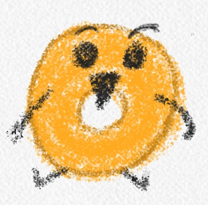
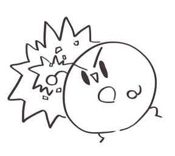
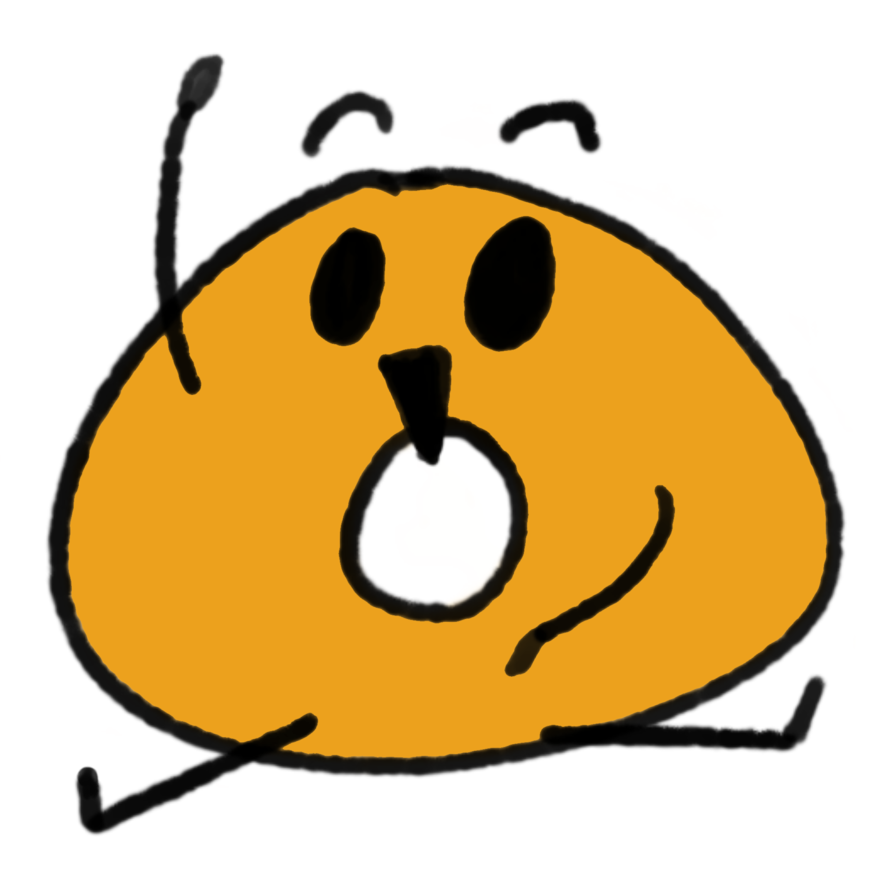

  

    
    
    
    
  

    <h2> Hello Everyone! </h2>

    I'm a Beginner Programmer.
    I My Favorite Food is Donut. 🍩

  

     
  

   

  <h1> Practic Stack 💪</h1>
  

    <!--.Net-->
    &nbsp
    <!--Android-->
    &nbsp
    <!--Java-->
    &nbsp
    <!--Kotlin-->
    &nbsp
  

   
   

  

  

